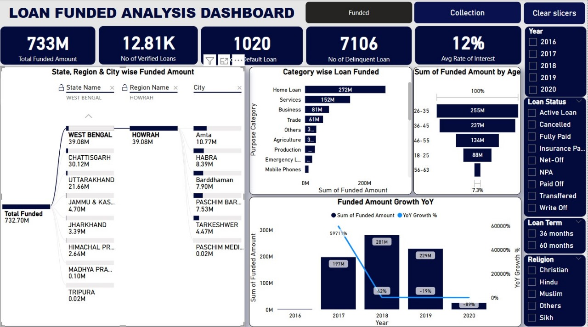
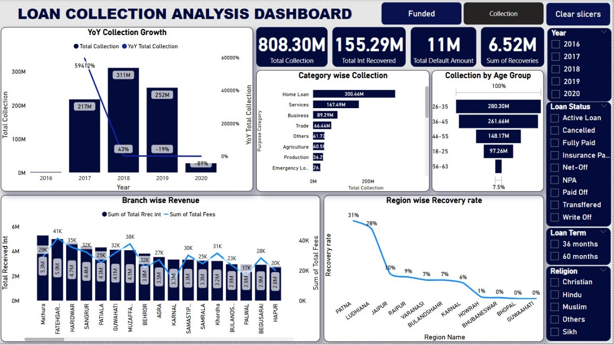

# 📊 Loan Funding & Collection Analysis Dashboard (Power BI)

## 📝 Problem Statement
A banking institution wants to track how loans are being funded and collected across different states, age groups, and loan types. The goal is to:
- Identify where the highest loan disbursals are happening.
- Detect categories with the most defaults or delays.
- Understand how collections vary across branches.
- Support better loan planning and recovery strategies.

This **Power BI Dashboard** provides a comprehensive analysis of loan disbursements, defaults, and collections to help banks make data-driven decisions.

---

## 🚀 Key Performance Indicators (KPIs)
- **Total Funded Amount**  
- **Total Interest Recovered**  
- **Total Loan Default Amount**  
- **Principal Recovered**  
- **Average Rate of Interest**  
- **Disbursement Trend (YoY)**  
- **Age-wise Loan Distribution**  
- **State, Region, & City-wise Funded Amount**  
- **Top Defaulter States & Regions**  
- **Branch-wise Collections & Recovery Rates**  
- **Year-Wise Trend: Interest vs Loan Amount**

---

## 📈 Dashboard Preview

### 🔹 Loan Funded Analysis Dashboard

### 🔹 Loan Collection Analysis Dashboard

---

## 📈 Dashboards Overview
### **1. Loan Funded Analysis Dashboard**
- State, Region & City-wise funded amount.
- Category-wise loan funded (Home, Business, Trade, etc.).
- Funded Amount Growth (YoY).
- Age-wise loan funded distribution.
- Identification of high-risk regions & categories.

### **2. Loan Collection Analysis Dashboard**
- YoY Collection Growth & Recovery Trends.
- Branch-wise revenue & recovery rates.
- Collection by Age Group.
- Category-wise Collection Analysis.

---

## 🔑 Key Takeaways
### **1. Geographic Performance Variance**
- **Patna** shows high default rates → stricter credit checks required.
- Other states performing well → implement **location-specific risk profiling**.

### **2. Demographic Trends**
- **26–35 age group** = most active borrowers → potential for **premium loan offers**.
- **18–25 & 46–55 age groups in Patna** = high defaults → targeted **risk management**.
- **35–50 age group** = largest loan volume → suitable for **long-term lending products**.

### **3. Loan Characteristics**
- **Longer-duration loans** = higher interest rates & mostly verified.
- **Shorter-duration loans** = often not verified → **compliance concern**.
- **Patna** region = highest recovery on defaulted loans → effective **collection strategies**.

---

## 💡 Recommendations
1. **Reduce Defaults** → Stricter loan checks & filtering processes.  
2. **Focus on Strong States** → Increase funding in **Uttar Pradesh & Punjab** with flexible loan offers.  
3. **Targeted Marketing** → Promote loans to the **26–35 age group** via mobile apps & SMS.  
4. **Analyze YoY Trends** → Investigate why funding declined post-2018.  
5. **Branch-wise Monitoring** → Track delinquent loans monthly & set default alerts (>10%).  
6. **Improve Recovery** → Launch recovery drives in low-performing cities.  
7. **Risk-based Interest Rates** → Link interest rates to regional risk (Red/Yellow/Green Zones).

---

## 🛠️ Tech Stack
- **Tool**: Power BI  
- **Data Source**: Loan Disbursement & Collection Dataset (CSV/XLSX)  
- **Visualization Techniques**: DAX Measures, YoY Growth Calculations, Drill-Through Filters, Hierarchical Mapping  

